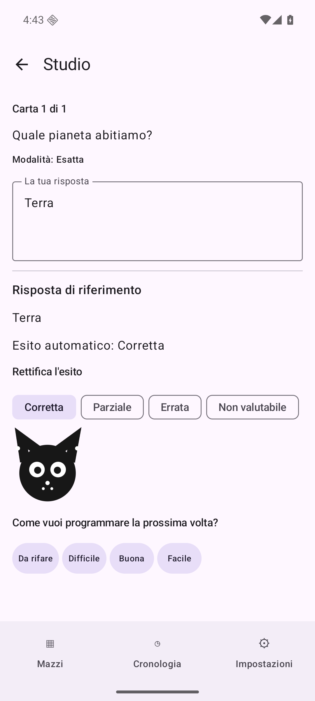
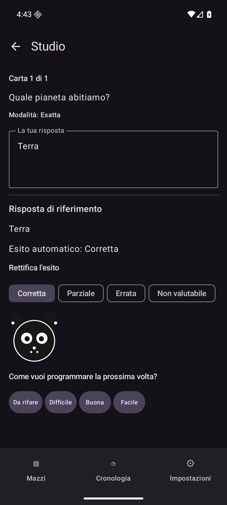

# Memoro

App Android in **Kotlin e Jetpack Compose**, con flashcard locali, ripasso FSRS-6 e controllo facoltativo delle risposte aperte tramite DeepSeek. Open source, licenza [BSD-2-Clause](LICENSE), senza account Memoro.

 

## Funzioni

- Mazzi e note manuali: fronte/retro, inverse e cloze; immagini e audio locali.
- Studio classico, risposta scritta esatta oppure correzione AI con chiave personale.
- Risposta di riferimento, errori e omissioni; fonte facoltativa inserita manualmente. Puoi rettificare l'esito e scegliere separatamente il voto del ripasso.
- Cronologia dei tentativi, statistiche, bozze persistenti e ripristino dopo rotazione.
- Importazione/esportazione Anki `.apkg`, backup ZIP completo dei contenuti.
- Gattino nero facoltativo, disattivato inizialmente; tema chiaro/scuro di sistema.

## Compilazione e installazione

Richiede JDK 17 e Android SDK con `platforms;android-35`, `build-tools;35.0.0` e `platform-tools`. Il wrapper scarica la versione fissata di Gradle; la prima compilazione richiede rete per le dipendenze. Android Studio può importare direttamente questa cartella. Imposta il percorso SDK in `local.properties` (`sdk.dir=/percorso/android-sdk`) oppure in `ANDROID_HOME`.

```sh
./gradlew assembleDebug
adb install -r app/build/outputs/apk/debug/app-debug.apk
```

Compatibile con Android 8.0/API 26 o successivo. L'APK è una build debug installabile, non una release firmata per il Play Store. GitHub Actions pubblica l'artefatto `memoro-debug-apk` nelle [esecuzioni del workflow](https://github.com/giovannipivatoo/memoro/actions/workflows/android.yml).

```sh
./gradlew testDebugUnitTest lintDebug
# Con un emulatore o dispositivo Android avviato:
./gradlew connectedDebugAndroidTest
```

I test strumentali usano dati sintetici e possono sostituire l'archivio dell'app: eseguirli su un emulatore dedicato. Le prove e i loro limiti sono in [ACCEPTANCE.md](ACCEPTANCE.md).

## Primo utilizzo

1. In **Mazzi**, crea un mazzo e aggiungi una nota. Una nota inversa genera due carte. Per una cloze scrivi, per esempio, `Roma è la capitale {{c1::d'Italia}}`.
2. Seleziona le carte nel mazzo e scegli **Classica**, **Esatta** o **AI**. Le carte importate partono in modalità classica. Esatta ignora maiuscole e spazi esterni, ma distingue accenti e punteggiatura; per le cloze confronta il termine nascosto.
3. Tocca **Studia**. Dopo l'invio puoi correggere il giudizio, anche per un refuso. Solo **Da rifare / Difficile / Buona / Facile** registra il ripasso e aggiorna la scadenza. Un problema di rete non viene trattato come una risposta errata.
4. In **Cronologia**, consulta ripassi e tentativi oppure cancella testo e feedback personali mantenendo il voto già registrato.

In **Impostazioni** puoi attivare il gattino, importare/esportare `.apkg`, creare un backup o ripristinarlo. La conferma di ripristino sostituisce l'archivio dopo la validazione e conserva sul dispositivo una copia preventiva. Per spostare anche fonti, tentativi e feedback usa il backup Memoro: questi dati aggiuntivi non fanno parte del formato Anki.

Per la correzione AI salva la tua chiave DeepSeek e il modello nelle impostazioni. La chiave è protetta da Android Keystore e non entra nel backup. Solo un invio esplicito in modalità AI trasmette domanda, riferimento, risposta e l'eventuale estratto fonte a DeepSeek. Non vengono caricati mazzi interi o file; gli URL della fonte sono metadati e non vengono aperti. Senza chiave o rete puoi usare l'autovalutazione. La prova con una chiave reale resta da effettuare; i test automatici usano un server simulato.

## Compatibilità e limiti della v0.1

Anki legacy e moderno sono verificati con fixture e importazione nel motore Anki 26.9.3: note base/inverse/cloze, GUID, campi, scadenze, stato, cronologia e byte dei media. L'esportazione moderna usa un database compatibile schema 11 in contenitore zstd. Template personalizzati e JavaScript vengono mostrati in forma semplificata e inerte, con avvisi; JavaScript e rete dalle carte sono disabilitati. Impostazioni avanzate dei modelli e preset personalizzati non sono riprodotti integralmente; l'esportazione lo segnala e i pacchetti originali sono conservati nel backup. Riferimenti a media dentro CSS/template personalizzati possono richiedere correzioni manuali dopo una collisione di nomi.

Le scadenze importate restano valide fino al ripasso in Memoro, che applica FSRS-6 con retention 90%, passi di apprendimento predefiniti e senza fuzzing. In assenza dello stato FSRS, il primo ripasso stima la memoria dall'intervallo Anki. Non è garantita identità con ogni configurazione di Anki. Il confronto fra modifiche locali e importate usa i timestamp dei dispositivi.

Tutti i contenuti sono salvati nello spazio privato dell'app, senza backup cloud Android automatico. Esporta periodicamente un backup: disinstallare l'app rimuove i dati locali. Chiave API e preferenze dell'interfaccia non vengono trasferite dal backup. Le generazioni precedenti dei file dopo un ripristino e i file lasciati da importazioni interrotte possono occupare spazio aggiuntivo; questa versione non include una pulizia automatica.

Generazione AI delle carte, elaborazione testo/PDF, OCR, `.colpkg`, AnkiWeb e sincronizzazione cloud sono fuori dalla v1.

## Documentazione e collaborazione

[Specifica](SPEC.md) · [Architettura](ARCHITECTURE.md) · [Verifiche](ACCEPTANCE.md) · [Istruzioni per gli agenti](AGENTS.md) · [Dipendenze](THIRD_PARTY.md) · [Provenienza FSRS](THIRD_PARTY_FSRS.md).

Il lavoro passa da branch e pull request, con build, lint, test unitari e test su emulatore in CI. Gli agenti GPT-6 Sol si dividono dati/scheduler, Anki e UI/AI e si scambiano direttamente feedback sui contratti condivisi.
